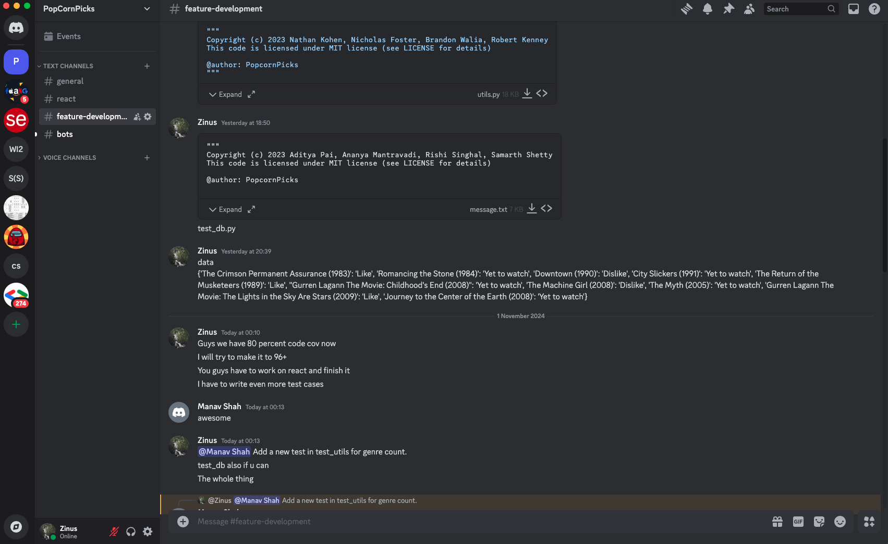

# PopcornPicks Developers Chat

This is a screenshot of what our developers' communication channel looks like.

## Means of Communication

As a team, we mainly used to meetup and we also used Discord voice channels and text channels to communicate about PopcornPicks.
We used PopcornPicks in this channel to test its functionality locally. We also had bots setup to get updates about the github issues, pushes, PRs and so on.
